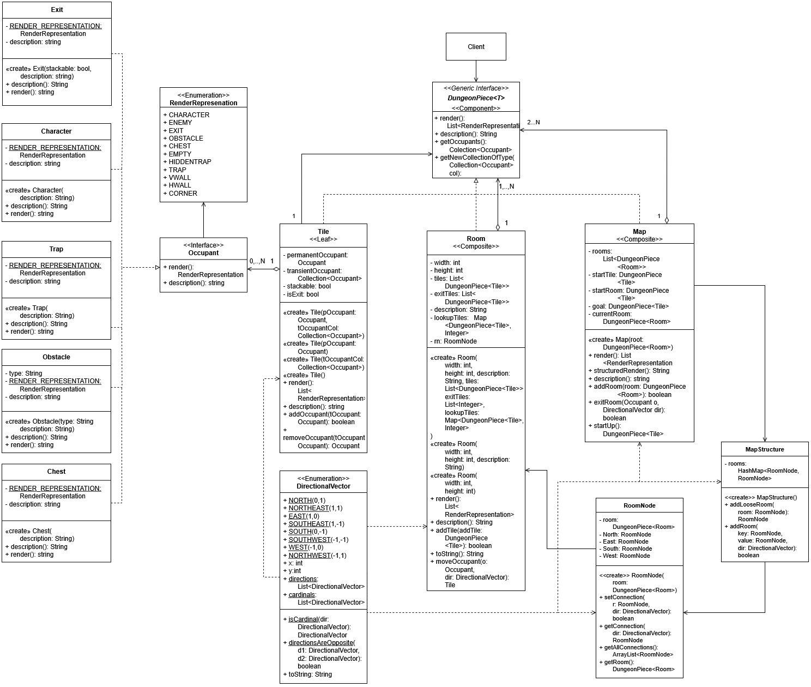

# Class Dungeon Project

This was a group project for Swen-262 Design of Software Subsystems, it is an ascii-styled infinite dungeon crawler and is an requirement to be allowed to go on co-op.

At a high-level, this class is an in-depth first look at how to properly design a complex software project by breaking it down into smaller pieces and applying various [Gang of Four](https://en.wikipedia.org/wiki/Design_Patterns) patterns. Additionally, the class emphasized a lot of work outside of coding: creating design docs, reports, presentations about our systems, and various UML Diagrams. 

## My Contributions

My task for this project was doing all the programming from the map down. What that means, is that I created the classes for a majority of the tile, room, and map. This also lead to other things I worked on, such as the occupant interface for tiles, and most of its realizations. Some notable classes that I did most of the work on [Room](https://github.com/DannyCato/ClassDungeonCrawler/blob/main/src/main/java/edu/rit/swen262/domain/DungeonPiece/Room.java) and [Trap](https://github.com/DannyCato/ClassDungeonCrawler/blob/main/src/main/java/edu/rit/swen262/domain/Trap.java).

I also handled, map rendering, player movement, and map layout on a back-end scale. These were all sort of additional effects that were easy to add to the system so i got them done even if they were not in the explicit requirements for my portion.

## The Design

The main parts of the system all extend a generic interface called [DungeonPiece](https://github.com/DannyCato/ClassDungeonCrawler/blob/main/src/main/java/edu/rit/swen262/domain/DungeonPiece/DungeonPiece.java). In essence, it allows for each one of the elements to contain a list of the other and allow for recursive inclusion of a class in another instance of itself following the [Composite Pattern](https://en.wikipedia.org/wiki/Composite_pattern). This was doing most of the heavy lifting for organziation of the structure.

The data structure that the Map used was a simple "graph" \([MapStructure](https://github.com/DannyCato/ClassDungeonCrawler/blob/main/src/main/java/edu/rit/swen262/domain/DungeonPiece/MapStructure.java)\) with four possible connections \([RoomNode](https://github.com/DannyCato/ClassDungeonCrawler/blob/main/src/main/java/edu/rit/swen262/domain/DungeonPiece/RoomNode.java)\). These did the work of connecting each room in the map, and would be continually genearted in the endless mode.

The representation for all the different pieces in the game, from playable characters to rocks. These were refered to as the [Occupant](https://github.com/DannyCato/ClassDungeonCrawler/blob/main/src/main/java/edu/rit/swen262/domain/Occupant.java) subsystem. The spirit of the system relies on how it interacts with the [Tile](https://github.com/DannyCato/ClassDungeonCrawler/blob/main/src/main/java/edu/rit/swen262/domain/DungeonPiece/Tile.java). The Tile has two slots for occupants, permanent and transient. The permanent occupants are given to the tile on creation and represent things like obstacles, exits, and chests. Transient Occupants are allowed to move around or can reasonably be removed, including things like the player character, enemies, and traps. All these occupants also contain a specific [RenderReprestation](https://github.com/DannyCato/ClassDungeonCrawler/blob/main/src/main/java/edu/rit/swen262/domain/RenderRepresentation.java) which is constant for every subclass of Occupant. This is also where the rule for what occupants allow others on its tile, like an Obstacle would not let a player move through it. This RenderRepresentation, is then complied and rendered to the screen for viewing of the game.



## What We did Well

### Teamwork

If we asked for help, people would quickly come to our aid. We used slack during the class and it allowed for us to keep rapidly devloping.

### Commenting

There was a trend in the group to comment. This made developing between systems easier since we can just look at what anything does. (I believe I kicked this trend off cause I spent a few hours putting down a lot of comments at the beginning of the project.)

## Issues the Group Faced

### Difficulty

Of the projects offered in the course, this was by far the hardest. The problem statement for phase one was nearly 5 pages long and phase two was a little over 3 pages, while the other projects' statements did not exceed a page. Part of the final grading for this project was that all feature from phase one were well implemented. This lead to a lot of stress since it coincided with the final deliverable for phase 2. This specific project has since been retired by the department for this reason. All that said, we still made the most out of the situation and I am proud of it.

### Lack of Time for Code Development

The project was developed in two phases each of which lasted a week, that were before or during midterms. However, we were given an excess of time for design, ususally about 3 weeks with explicit instructions to not start until it was approved by teaching staff. The first phase was just to lay down the basics of the game and make sure that we understand the project. The second phase was about fleshing out the features and refactoring our code to be expandable without many additional rewrites (our group started with a decent design that kept it to a minimum).

## Issuse I Faced

### Scope Creep

I spent nearly a few days making a complicated system that would take the size of the room and sprawl outwards such that there minimal gaps inbetween rooms, like a real place. This would mean that large rooms could have an execptional number of connections and lead to interesting gameplay but it was shelved for simplicity and my own sanity. Instead, a less complicated graph with connections in each cardinal direction was developed. This lead to me feeling a bit of burnout, but i managed to work around it.

### Illness

My output during the second phase was also greatly reduced due to catching Covid during that week.

## Check it Out

To run this project, clone and run 
```shell
./mvnw spring-boot:run
```
